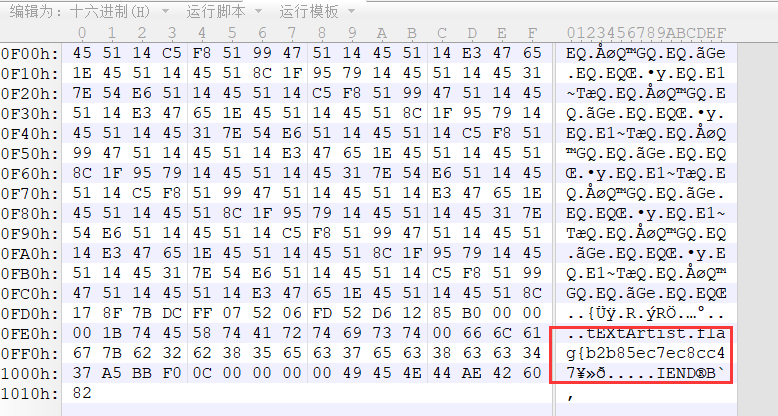
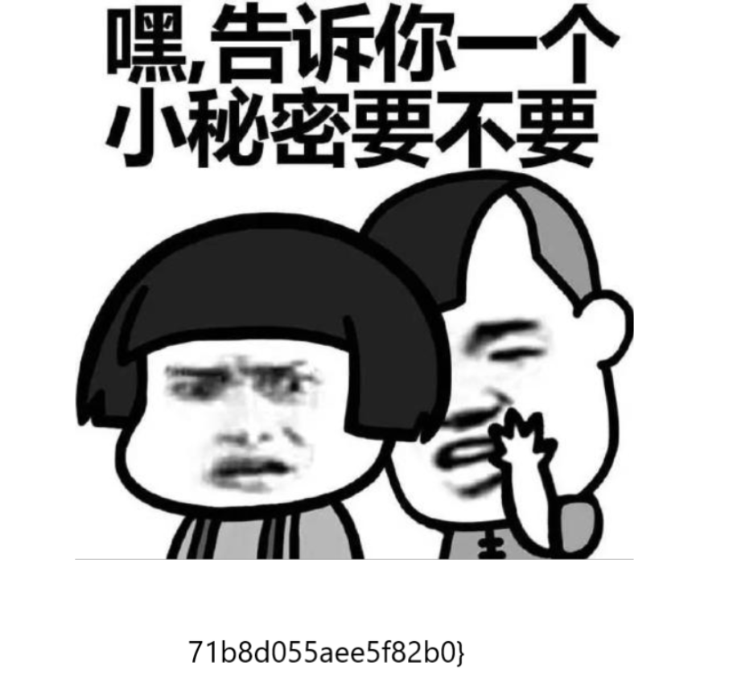

## 签到题
改一下图片高度

flag：flag{b2b85ec7ec8cc4771b8d055aee5f82b0}

## 唯有低头，才能出头
了一行字符串：99 9 9 88 11 5 5 66 3 88 3 6 555 9 11 4 33

根据题目意思应该是键盘密码，数字的重复次数代表第几行。99代表9下面第二行的L，9代表9下面第一行的o，以此类推。

## 流量签到
记事本打开，搜索flag。

flag：SWPUCTF{Th1s_i3_e4sy_pc@p}
